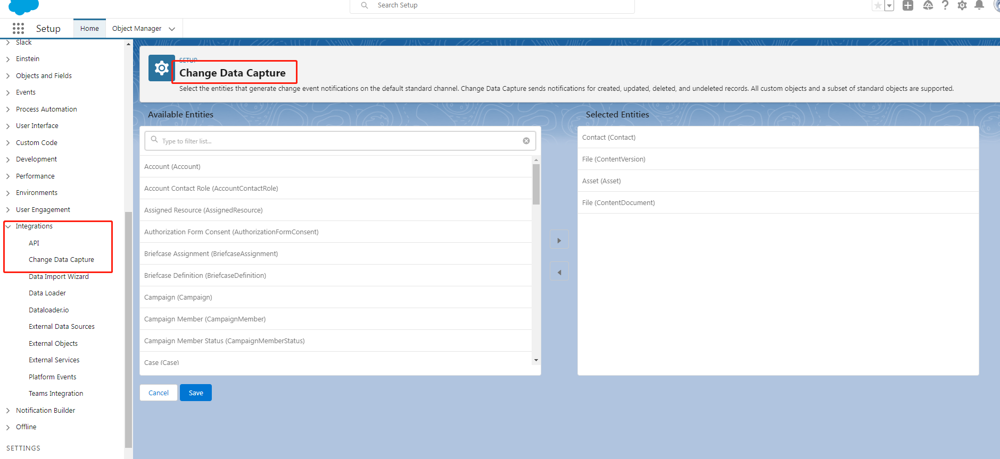

# salesforce 获取数据监听方式

不管是基于Topic 方式或者CDC数据获取都是通过Streaming API来实现.具体参考如下:
[相关详细信息](https://developer.salesforce.com/docs/atlas.en-us.api_streaming.meta/api_streaming/event_comparison.htm)

## salesforce 基于Topic 方式

topic实现一般历史消息保留1天,支持crud 操作监听。
相关文档:
- salesforce官方文档
https://developer.salesforce.com/docs/atlas.en-us.api_streaming.meta/api_streaming/working_with_pushtopics.htm
- camel详解介绍使用
https://camel.apache.org/components/3.18.x/salesforce-component.html#_push_topics


开发步骤:
- 基于camel编写对应的consumer
实现salesforce 联系人变更监听代码:
```
        //基于topic 方式
        from("salesforce:contact?rawPayload=True&notifyForFields=ALL&notifyForOperationUpdate=True&sObjectName=Contact&sObjectClass=Contact&updateTopic=true&sObjectQuery=SELECT Id, Name, Email, Phone FROM Contact&defaultReplayId=-2")
                .unmarshal().json()
                .choice()
                .when(header("CamelSalesforceEventType").isEqualTo("created"))
                .log("New Salesforce contact was created: [ID:${body[Id]}, Name:${body[Name]}, Email:${body[Email]}, Phone: ${body[Phone]}]")
                .when(header("CamelSalesforceEventType").isEqualTo("updated"))
                .log("A Salesforce contact was updated: [ID:${body[Id]}, Name:${body[Name]}, Email:${body[Email]}, Phone: ${body[Phone]}]")
                .when(header("CamelSalesforceEventType").isEqualTo("undeleted"))
                .log("A Salesforce contact was undeleted: [ID:${body[Id]}, Name:${body[Name]}, Email:${body[Email]}, Phone: ${body[Phone]}]")
                .when(header("CamelSalesforceEventType").isEqualTo("deleted"))
                .log("A Salesforce contact was deleted: [ID:${body[Id]}]");
```

## salesforce 基于CDC方式

CDC实现一般历史消息保留3天，支持crud 操作，但是salesforce 默认最大支持10个Object的CDC(需要确认）。

相关文档
- salesforce 官方文档
   https://developer.salesforce.com/docs/atlas.en-us.240.0.change_data_capture.meta/change_data_capture/cdc_intro.htm
- camel详解介绍使用
https://camel.apache.org/components/3.18.x/salesforce-component.html#_change_data_capture_events

开发步骤:
- 需要配置CDC对应Object

- 基于camel编写对应的consumer
实现CDC配置的所有Object数据变化监听，代码如下：
```
from("salesforce:data/ChangeEvents?replayId=-1").log("receive of change events for Contact records");
```

## 下载salesforce存储的文档
用户上传的文件，可能存储在Attachment, ContentDocument, ContentNote, Document, Folder, and Note等Object 里面
### 相关文档
 - salesforce官方文档
https://developer.salesforce.com/docs/atlas.en-us.234.0.api_rest.meta/api_rest/resources_sobject_blob_retrieve.htm
https://developer.salesforce.com/docs/atlas.en-us.228.0.object_reference.meta/object_reference/sforce_api_objects_contentversion.htm
### 开发步骤
 - 获取对应的blobField
查询ContentVersion相关的文档信息获取blobField
```
        from("direct:attachment")
                .to("salesforce:query?sObjectQuery=SELECT Id, FileExtension,Title FROM ContentVersion&sObjectClass=com.camel.salesforce.dtos.QueryRecordsAttachment")
 
```
 - 调用salesforce api /services/data/vXX.X/sobjects/sObject/id/blobField 获取二进制文件
```
    @EventListener
    @Async
    public void processBlockedListEvent(SalesforceSobjectEvent event) {
        //参考文档 https://developer.salesforce.com/docs/atlas.en-us.234.0.api_rest.meta/api_rest/resources_sobject_blob_retrieve.htm
        String uriTemplate = url;
        URI uri = UriComponentsBuilder.fromUriString(uriTemplate).build(event.getDto().getBlobField());
        RequestEntity<Void> requestEntity = RequestEntity.get(uri)
                .header("Authorization", "Bearer " + event.getDto().getAccessToken())
                .build();
        String fileName = event.getDto().getFileName() + "." + event.getDto().getFileType();
        log.info("start down file name :" + fileName);
        ResponseEntity<byte[]> response = restTemplate.exchange(requestEntity, byte[].class);
        File file = new File(fileName);
        try {
            FileUtils.writeByteArrayToFile(file, response.getBody());
        } catch (IOException e) {
            //todo
            e.printStackTrace();
        }
        log.info("end down file name :" + fileName);
    }
```

## 启动项目
发送get请求:http://localhost:8081/camel/api/attachment,代码会自动下载salesforce 里面的ContentVersion存储的所有文件。


## camel 关键类
